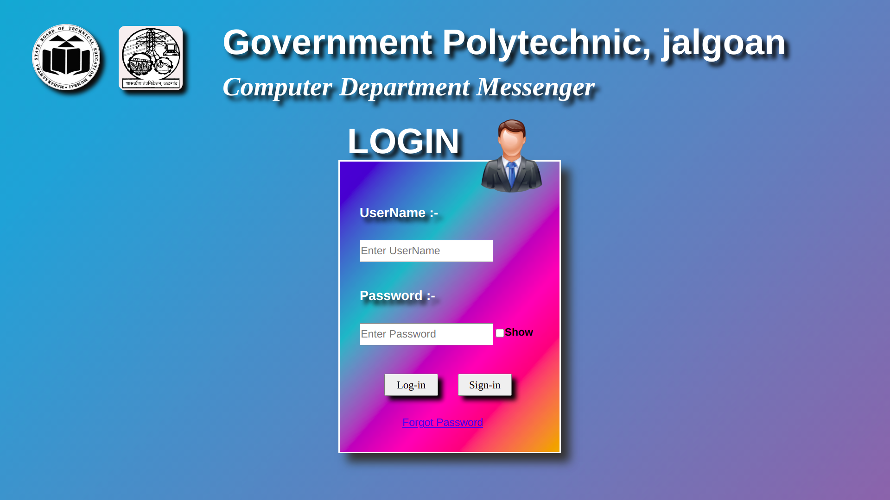
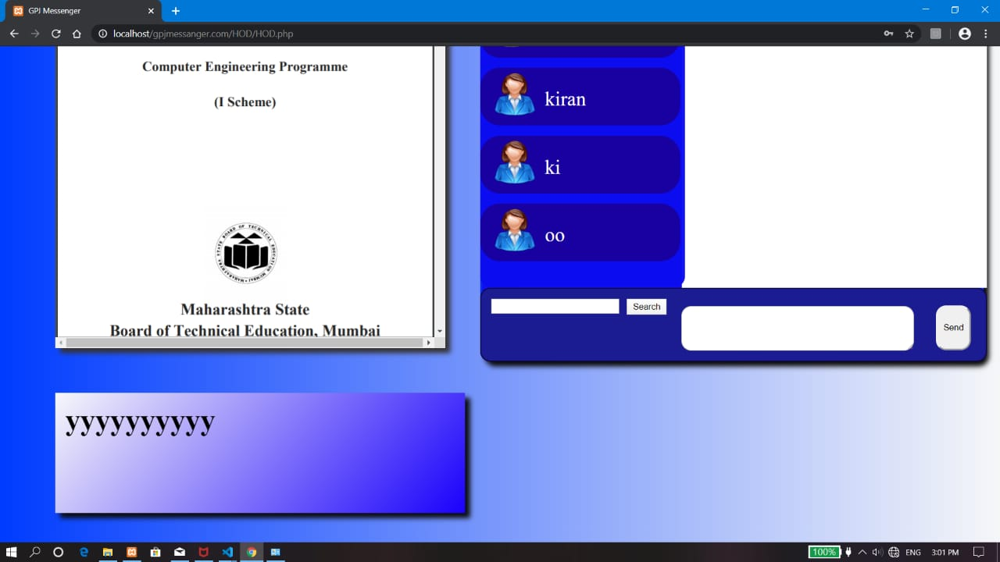
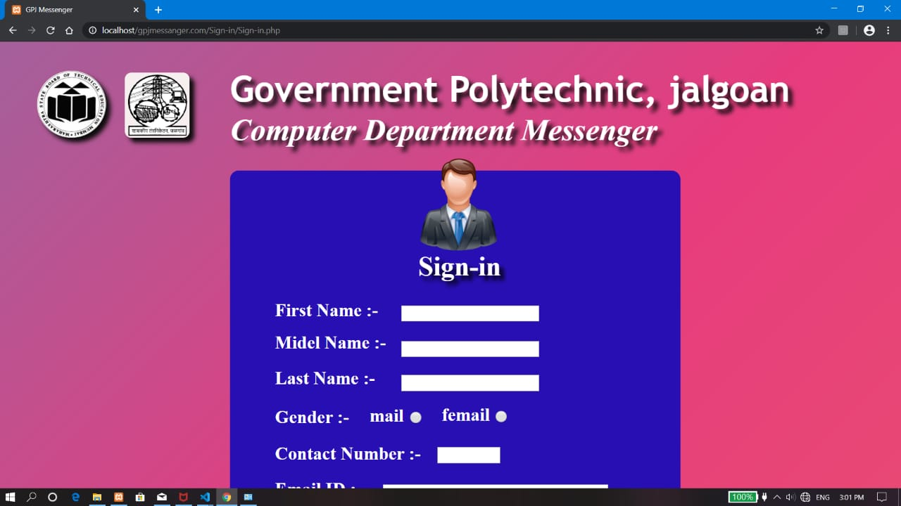

# gpjmessenger
This is my final year (Diploma) project. In this project I have implemented a problem statement to make one platform to communicate all department staff and publish new circulars 

This project contain 
,html
,css
,javascript
,php 

I not use (Bootstrap) whole gui make by html and css 

Login Page 
-----------------

     

home Page 

     

Sign up Page 
-----------------

     

